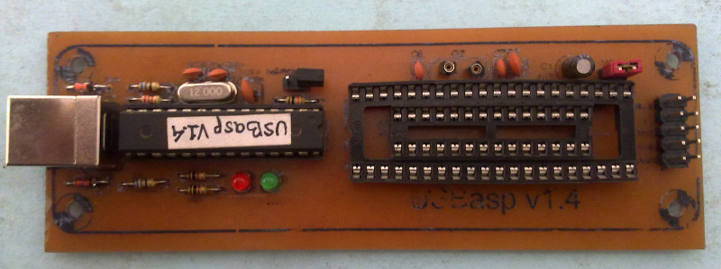
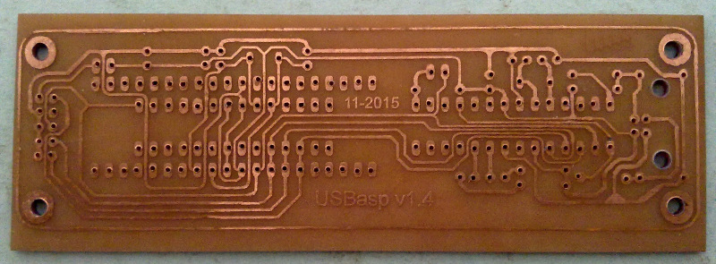

## USBasp with Automatic Software Controlled Clock
---

### Informasi

* __fusebits.txt - Pengaturan fusebit untuk ATmega8 untuk USBasp.
* __firmaware.hex__ - Automatic Software Controlled Clock Jumper Free USBasp ATmega8.
* __usbasp_plus_target.sch__ - Skematik untuk USBasp.
* __usbasp_plus_target.brd__ - Layout untuk board USBasp.

### Catatan

* Firmware yang digunakan adalah __Automatic software controlled clock__ sehingga tidak perlu melakukan pengaturan __Low SCK__ lagi.
* Pada layout board USBasp ini terdapat sebuah jalur yang _unrouted_. Cukup abaikan jalur tersebut, karena memang tidak digunakan.
* Board ini telah melalui proses pengujian, dan berfungsi sesuai dengan yang diharapkan.

### Referensi

* [USBasp - USB programmer for Atmel AVR controllers](http://www.fischl.de/usbasp/)
* [Automatic Software Controlled Clock Jumper Free USBasp](https://automasys.wordpress.com/2013/02/16/%D9%BE%D8%B1%D9%88%DA%98%D9%87-%D8%A7%D9%84%DA%A9%D8%AA%D8%B1%D9%88%D9%86%DB%8C%DA%A9-avr-usbasp/)

